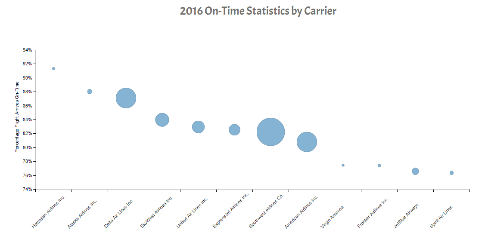
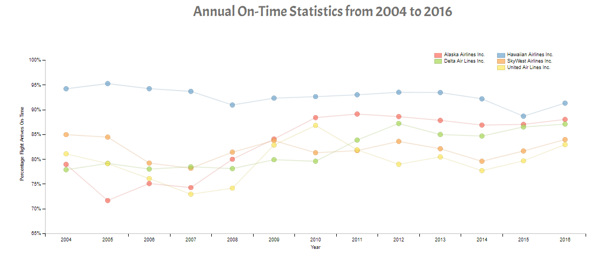
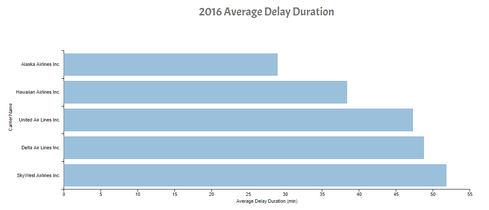

# Explanatory Data Visualization - US Flight Data

## Summary

The purpose of this project is to analyze a dataset and create a story through visualizations using dimple.js or d3.js. 
For this particular exercise a dataset containing information on US airline on-time statistics and delay causes from 
January 2004 until December 2016 was analyzed. The dataset was obtained from the 
[Bureau of Transportation Statistics](https://www.transtats.bts.gov/OT_Delay/OT_DelayCause1.asp?pn=1).

The goal of this exercise is to answer the following questions so that the next time I travel I can properly weigh the 
costs with the probability of delay when selecting an airline carrier:
1. As of 2016, which airline carriers are most likely to be on time?
2. Since 2004, have these airline carriers been improving or getting worse with regards to their punctuality?

## Design

Given the goal stated above, the following variables were identified as essential to the analysis:

1. year
2. carrier_name
3. arr_flights
4. arr_del15
5. carrier_delay
6. late_aircraft_delay

Additionally, two calculated fields were added: 
1. arr_on_time = arr_flights - arr_del15
2. delay_duration_due_to_carrier = carrier_delay + late_aircraft_delay

The first was to indicate the number of times a carrier arrived on time and the second was to indicate the delay 
duration due to the fault of the airline carrier. Do note that a flight is counted as "on time" if it operated 
less than 15 minutes later than the scheduled time shown in the carriers' Computerized Reservations Systems (CRS).

### Which carrier is currently the most punctual?

To answer this question I initially created a bar chart but decided to change it into a scatter plot with the size of each data 
point representing the number of flights that the carrier had completed in 2016. This was done in response to feedback that the
most punctual carriers may not necessarily be the most accessible/convenient carriers.

The plot shows that Hawaiian Airlines Inc. was the most punctual carrier in 2016, with a success rate of 91%. However, 
it should be highlighted that Haiwaiian Airlines only completed <10% of the flights compared to the major airlines such as 
Delta, Southwest or American Airlines. The plot also shows that lesser flights does not necessarily correlate to better service. 
Virgin America, Frontier and Spirit Airlines all offer fewer flights but have the lowest on-time percentages.

Nevertheless, I wanted to verify if the top 5 most punctual carriers have been consistently punctual since 2004.

### Has the airlines punctuality been consistent over the years?

For this question a line chart together with a scatter plot was selected to depict the progress of the top 5 carriers' 
performances from 2004 to 2016. The scatter plot was added to help accentuate the data points. Additionally some mouse 
over capabilities were added to accent the lines being analyzed.

From this plot, we see that Hawaiian Airlines' punctuality has consistently been very high, oscillating between 89% and 95%.
In fact, 2016 is one of the years its on-time percentage dropped. It is also important to note that Alaska Airlines has 
drastically improved its services since 2005 when its planes used to be late 28% of the time to 2016 where its planes are 
only late 12% of the time. Furthermore, their punctuality has been consistent since 2010. 

However, when a carrier is delayed, on average, how delayed are they?

### When a carrier is delayed, how long are they delayed for?

It was decided that it was best to compare carriers based on the most recent statistics rather than plot the average delays
over time so a horizontal bar chart was chosen. Again only the top 5 carriers were compared against each other.

This plot shows that not only are Alaska Airlines and Hawaiian Airlines the most reliable in 2016 at being on time, even when
they are delayed, they are only delayed on average by 29 and 38 minutes, respectively.

In conclusion, if you need to be somewhere within the US and it is important that you arrive on time, the most reliable carriers
are Hawaiian and Alaska Airlines. It should be noted, however, that the number of routes provided by these two carriers
are limited so the next best option would probably be to travel on Delta Airlines. 

## Feedback
I requested feedback on my data visualizations from friends who, should be highlighted, are not data analysts. Below are some of
their feedback which I have incorporated into my visualizations:

1. The x-axis labels on the first plot are hard to read 
	* Rotated the labels 225 degrees so that carrier names can be read left to right
2. Bar chart and line chart do not really highlight the difference between the carriers as the variance is not distinguishable
	* Added following code, y.overrideMin = 0.5, to reduce the range of the y-axes
3. The most punctual carriers may not necessarily be the most accessible/convenient carriers
	* Changed bar chart into a scatter plot with bubble size to represent the number of flights completed in 2016
4. Hard to differentiate the lines in the line chart
	* Added scatter plot to accentuate the data points
	* Added legend
	* Added mouseover to highlight the line being analyzed
5. Horizontal bar chart can be simplified as the previous plot only considers the top 5 most punctual carriers
	* Added a filter to only plot the average delay duration for the top 5 most punctual carriers

## Resources

* [Learn JS Data](learnjsdata.com/group_data.html)
* [Bureau of Transportation Statistics](https://www.transtats.bts.gov/OT_Delay/OT_DelayCause1.asp)
* [Dimple JS Examples](http://dimplejs.org/examples_index.html)